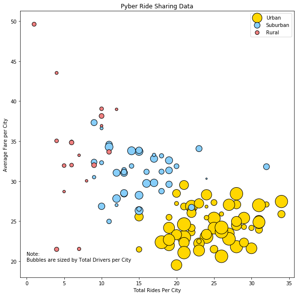

# Pyber Ride Sharing
Pyber Exercise
written by: A. Lam

# Analysis:
- Observation 1:
- Observation 2:
- Observation 3:

# Setup


```python
# Modules
import os
import pandas as pd
import matplotlib.pyplot as plt
```


```python
# import raw data
city_data_path = os.path.join('..','Instructions','Pyber','raw_data','city_data.csv')
ride_data_path = os.path.join('..','Instructions','Pyber','raw_data','ride_data.csv')
city_data = pd.read_csv(city_data_path)
ride_data = pd.read_csv(ride_data_path)
```


```python
city_data.head()
```


<div>
<style scoped>
    .dataframe tbody tr th:only-of-type {
        vertical-align: middle;
    }

    .dataframe tbody tr th {
        vertical-align: top;
    }

    .dataframe thead th {
        text-align: right;
    }
</style>
<table border="1" class="dataframe">
  <thead>
    <tr style="text-align: right;">
      <th></th>
      <th>city</th>
      <th>driver_count</th>
      <th>type</th>
    </tr>
  </thead>
  <tbody>
    <tr>
      <th>0</th>
      <td>Kelseyland</td>
      <td>63</td>
      <td>Urban</td>
    </tr>
    <tr>
      <th>1</th>
      <td>Nguyenbury</td>
      <td>8</td>
      <td>Urban</td>
    </tr>
    <tr>
      <th>2</th>
      <td>East Douglas</td>
      <td>12</td>
      <td>Urban</td>
    </tr>
    <tr>
      <th>3</th>
      <td>West Dawnfurt</td>
      <td>34</td>
      <td>Urban</td>
    </tr>
    <tr>
      <th>4</th>
      <td>Rodriguezburgh</td>
      <td>52</td>
      <td>Urban</td>
    </tr>
  </tbody>
</table>
</div>


```python
ride_data.head()
```


<div>
<style scoped>
    .dataframe tbody tr th:only-of-type {
        vertical-align: middle;
    }

    .dataframe tbody tr th {
        vertical-align: top;
    }

    .dataframe thead th {
        text-align: right;
    }
</style>
<table border="1" class="dataframe">
  <thead>
    <tr style="text-align: right;">
      <th></th>
      <th>city</th>
      <th>date</th>
      <th>fare</th>
      <th>ride_id</th>
    </tr>
  </thead>
  <tbody>
    <tr>
      <th>0</th>
      <td>Sarabury</td>
      <td>2016-01-16 13:49:27</td>
      <td>38.35</td>
      <td>5403689035038</td>
    </tr>
    <tr>
      <th>1</th>
      <td>South Roy</td>
      <td>2016-01-02 18:42:34</td>
      <td>17.49</td>
      <td>4036272335942</td>
    </tr>
    <tr>
      <th>2</th>
      <td>Wiseborough</td>
      <td>2016-01-21 17:35:29</td>
      <td>44.18</td>
      <td>3645042422587</td>
    </tr>
    <tr>
      <th>3</th>
      <td>Spencertown</td>
      <td>2016-07-31 14:53:22</td>
      <td>6.87</td>
      <td>2242596575892</td>
    </tr>
    <tr>
      <th>4</th>
      <td>Nguyenbury</td>
      <td>2016-07-09 04:42:44</td>
      <td>6.28</td>
      <td>1543057793673</td>
    </tr>
  </tbody>
</table>
</div>


```python
# Join of data sources
all_data = pd.merge(city_data,ride_data,on='city')
all_data.head()
```


<div>
<style scoped>
    .dataframe tbody tr th:only-of-type {
        vertical-align: middle;
    }

    .dataframe tbody tr th {
        vertical-align: top;
    }

    .dataframe thead th {
        text-align: right;
    }
</style>
<table border="1" class="dataframe">
  <thead>
    <tr style="text-align: right;">
      <th></th>
      <th>city</th>
      <th>driver_count</th>
      <th>type</th>
      <th>date</th>
      <th>fare</th>
      <th>ride_id</th>
    </tr>
  </thead>
  <tbody>
    <tr>
      <th>0</th>
      <td>Kelseyland</td>
      <td>63</td>
      <td>Urban</td>
      <td>2016-08-19 04:27:52</td>
      <td>5.51</td>
      <td>6246006544795</td>
    </tr>
    <tr>
      <th>1</th>
      <td>Kelseyland</td>
      <td>63</td>
      <td>Urban</td>
      <td>2016-04-17 06:59:50</td>
      <td>5.54</td>
      <td>7466473222333</td>
    </tr>
    <tr>
      <th>2</th>
      <td>Kelseyland</td>
      <td>63</td>
      <td>Urban</td>
      <td>2016-05-04 15:06:07</td>
      <td>30.54</td>
      <td>2140501382736</td>
    </tr>
    <tr>
      <th>3</th>
      <td>Kelseyland</td>
      <td>63</td>
      <td>Urban</td>
      <td>2016-01-25 20:44:56</td>
      <td>12.08</td>
      <td>1896987891309</td>
    </tr>
    <tr>
      <th>4</th>
      <td>Kelseyland</td>
      <td>63</td>
      <td>Urban</td>
      <td>2016-08-09 18:19:47</td>
      <td>17.91</td>
      <td>8784212854829</td>
    </tr>
  </tbody>
</table>
</div>


# Bubble Plot of Ride Sharing Data
Include:
- Average Fare per City (y)
- Total Rides per City (x)
- Total Drivers per City (Bubble Size)
- City Type (Color)


```python
city_types = all_data['type'].unique()
colors = ['gold','lightskyblue','lightcoral']
# add color assignment
c_assign = pd.DataFrame({'type' : city_types,
                        'color' : colors})
all_data_colored = pd.merge(all_data,c_assign,on='type')
all_data_colored.head()
# Create groupby over city
city_group = all_data_colored.groupby(['city'])
bubble_data = pd.DataFrame({
    'Average Fare' : round(city_group['fare'].mean(),2),
    'Total Rides' : city_group['ride_id'].count(),
    'Total Drivers' : city_group['driver_count'].mean(), # should all be the same value per city
    'City Type' : city_group['type'].min(), # should be identical per city
    'color' : city_group['color'].min() # should be identical per city
    })
bubble_data.head()
```


<div>
<style scoped>
    .dataframe tbody tr th:only-of-type {
        vertical-align: middle;
    }

    .dataframe tbody tr th {
        vertical-align: top;
    }

    .dataframe thead th {
        text-align: right;
    }
</style>
<table border="1" class="dataframe">
  <thead>
    <tr style="text-align: right;">
      <th></th>
      <th>Average Fare</th>
      <th>City Type</th>
      <th>Total Drivers</th>
      <th>Total Rides</th>
      <th>color</th>
    </tr>
    <tr>
      <th>city</th>
      <th></th>
      <th></th>
      <th></th>
      <th></th>
      <th></th>
    </tr>
  </thead>
  <tbody>
    <tr>
      <th>Alvarezhaven</th>
      <td>23.93</td>
      <td>Urban</td>
      <td>21</td>
      <td>31</td>
      <td>gold</td>
    </tr>
    <tr>
      <th>Alyssaberg</th>
      <td>20.61</td>
      <td>Urban</td>
      <td>67</td>
      <td>26</td>
      <td>gold</td>
    </tr>
    <tr>
      <th>Anitamouth</th>
      <td>37.32</td>
      <td>Suburban</td>
      <td>16</td>
      <td>9</td>
      <td>lightskyblue</td>
    </tr>
    <tr>
      <th>Antoniomouth</th>
      <td>23.62</td>
      <td>Urban</td>
      <td>21</td>
      <td>22</td>
      <td>gold</td>
    </tr>
    <tr>
      <th>Aprilchester</th>
      <td>21.98</td>
      <td>Urban</td>
      <td>49</td>
      <td>19</td>
      <td>gold</td>
    </tr>
  </tbody>
</table>
</div>


```python
# bubble_data.loc[bubble_data['City Type'] == city_types[0]]['Average Fare']
plt.figure(figsize = (10,10))
sf = 10 # scaling factor
for i in range(len(bubble_data['City Type'].unique())):
    ctype = bubble_data['City Type'].unique()[i]
    x = bubble_data.loc[bubble_data['City Type'] == ctype]['Total Rides']
    y = bubble_data.loc[bubble_data['City Type'] == ctype]['Average Fare']
    size = bubble_data.loc[bubble_data['City Type'] == ctype]['Total Drivers']
    plt.scatter(x, y, s = sf*size, 
                color = bubble_data.loc[bubble_data['City Type'] == ctype]['color'], 
                                      label = city_types[i], edgecolor = 'k')

plt.legend()
plt.title('Pyber Ride Sharing Data')
plt.xlabel('Total Rides Per City')
plt.ylabel('Average Fare per City')
plt.show()
```





# Total Fares by City Type


```python
group_type = all_data_colored.groupby(['type'])
plt.pie(group_type['fare'].sum(),
        labels = group_type['fare'].sum().keys(), 
        colors = group_type['color'].min(), 
        explode = [0,0.2,0.2],
       autopct = '%1.1f%%')
plt.title('% of Total Fares by City Type')
plt.axis('equal')
plt.show()
```


# Total Rides by City Type


```python
group_type = bubble_data.groupby(['City Type'])
plt.pie(group_type['Total Rides'].sum(),
        labels = group_type['Total Rides'].sum().keys(), 
        colors = group_type['color'].min(), 
        explode = [0,0.2,0.2],
       autopct = '%1.1f%%')
plt.title('% of Total Rides by City Type')
plt.axis('equal')
plt.show()
```


# Total Drivers by City Type


```python
group_type = all_data_colored.groupby(['type'])
plt.pie(group_type['driver_count'].sum(),
        labels = group_type['driver_count'].sum().keys(), 
        colors = group_type['color'].min(), 
        explode = [0,0.2,0.2],
       autopct = '%1.1f%%')
plt.title('% of Total Drivers by City Type')
plt.axis('equal')
plt.show()
```


