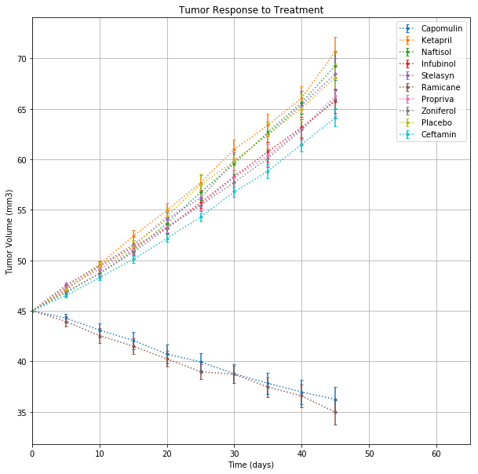
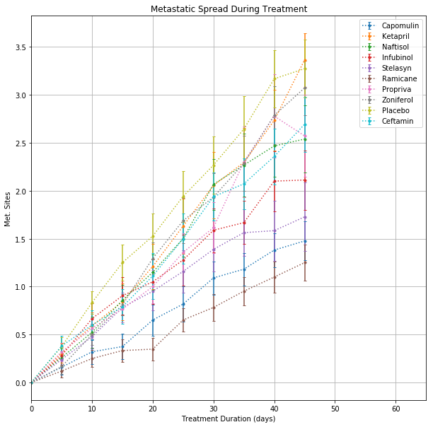
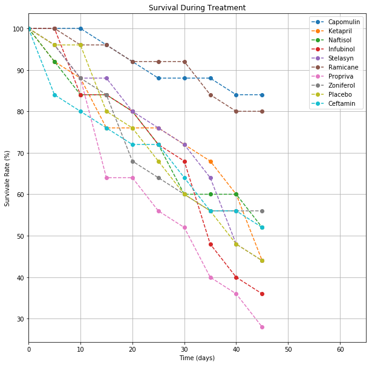
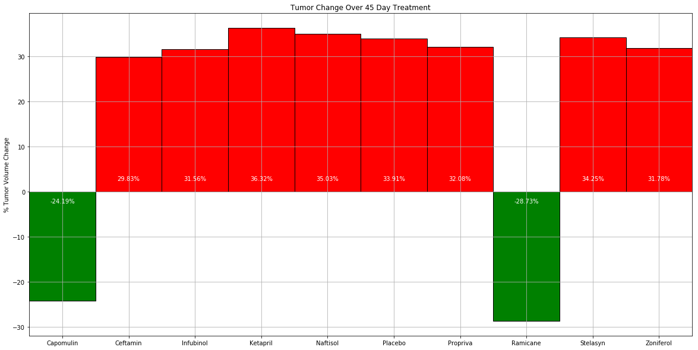

# Pymaceuticals
Pymaceuticals Exercise
written by: A.Lam

# Analysis
- Observation 1: Only two drugs: Capomulin and Ramicane result in reduced tumor volume. 
- Observation 2: It is no surprise that the two drugs that reduced tumor volume had the highest survival rate after the 45-day treatment program. Propriva had the lowest survival rate.
- Observation 3: Generally, none of the drugs were successful at preventing an increase of metastatic sites over time. However, Ramicane was able to slow the increase in sites the most.

# Setup


```python
# Modules
import os
import pandas as pd
import matplotlib.pyplot as plt
```


```python
# import raw data
clin_data_path = os.path.join('..','Instructions','Pymaceuticals','raw_data','clinicaltrial_data.csv')
mouse_data_path = os.path.join('..','Instructions','Pymaceuticals','raw_data','mouse_drug_data.csv')
clin_data = pd.read_csv(clin_data_path)
mouse_data = pd.read_csv(mouse_data_path)
```


```python
clin_data.head()
```


<div>
<style scoped>
    .dataframe tbody tr th:only-of-type {
        vertical-align: middle;
    }

    .dataframe tbody tr th {
        vertical-align: top;
    }

    .dataframe thead th {
        text-align: right;
    }
</style>
<table border="1" class="dataframe">
  <thead>
    <tr style="text-align: right;">
      <th></th>
      <th>Mouse ID</th>
      <th>Timepoint</th>
      <th>Tumor Volume (mm3)</th>
      <th>Metastatic Sites</th>
    </tr>
  </thead>
  <tbody>
    <tr>
      <th>0</th>
      <td>b128</td>
      <td>0</td>
      <td>45.0</td>
      <td>0</td>
    </tr>
    <tr>
      <th>1</th>
      <td>f932</td>
      <td>0</td>
      <td>45.0</td>
      <td>0</td>
    </tr>
    <tr>
      <th>2</th>
      <td>g107</td>
      <td>0</td>
      <td>45.0</td>
      <td>0</td>
    </tr>
    <tr>
      <th>3</th>
      <td>a457</td>
      <td>0</td>
      <td>45.0</td>
      <td>0</td>
    </tr>
    <tr>
      <th>4</th>
      <td>c819</td>
      <td>0</td>
      <td>45.0</td>
      <td>0</td>
    </tr>
  </tbody>
</table>
</div>


```python
mouse_data.head()
```


<div>
<style scoped>
    .dataframe tbody tr th:only-of-type {
        vertical-align: middle;
    }

    .dataframe tbody tr th {
        vertical-align: top;
    }

    .dataframe thead th {
        text-align: right;
    }
</style>
<table border="1" class="dataframe">
  <thead>
    <tr style="text-align: right;">
      <th></th>
      <th>Mouse ID</th>
      <th>Drug</th>
    </tr>
  </thead>
  <tbody>
    <tr>
      <th>0</th>
      <td>f234</td>
      <td>Stelasyn</td>
    </tr>
    <tr>
      <th>1</th>
      <td>x402</td>
      <td>Stelasyn</td>
    </tr>
    <tr>
      <th>2</th>
      <td>a492</td>
      <td>Stelasyn</td>
    </tr>
    <tr>
      <th>3</th>
      <td>w540</td>
      <td>Stelasyn</td>
    </tr>
    <tr>
      <th>4</th>
      <td>v764</td>
      <td>Stelasyn</td>
    </tr>
  </tbody>
</table>
</div>


```python
combined = pd.merge(clin_data,mouse_data,on='Mouse ID')
combined.head()
```


<div>
<style scoped>
    .dataframe tbody tr th:only-of-type {
        vertical-align: middle;
    }

    .dataframe tbody tr th {
        vertical-align: top;
    }

    .dataframe thead th {
        text-align: right;
    }
</style>
<table border="1" class="dataframe">
  <thead>
    <tr style="text-align: right;">
      <th></th>
      <th>Mouse ID</th>
      <th>Timepoint</th>
      <th>Tumor Volume (mm3)</th>
      <th>Metastatic Sites</th>
      <th>Drug</th>
    </tr>
  </thead>
  <tbody>
    <tr>
      <th>0</th>
      <td>b128</td>
      <td>0</td>
      <td>45.000000</td>
      <td>0</td>
      <td>Capomulin</td>
    </tr>
    <tr>
      <th>1</th>
      <td>b128</td>
      <td>5</td>
      <td>45.651331</td>
      <td>0</td>
      <td>Capomulin</td>
    </tr>
    <tr>
      <th>2</th>
      <td>b128</td>
      <td>10</td>
      <td>43.270852</td>
      <td>0</td>
      <td>Capomulin</td>
    </tr>
    <tr>
      <th>3</th>
      <td>b128</td>
      <td>15</td>
      <td>43.784893</td>
      <td>0</td>
      <td>Capomulin</td>
    </tr>
    <tr>
      <th>4</th>
      <td>b128</td>
      <td>20</td>
      <td>42.731552</td>
      <td>0</td>
      <td>Capomulin</td>
    </tr>
  </tbody>
</table>
</div>


```python
drug_types = combined['Drug'].unique()
# err_calc = lambda x: x*1.96 # 1.96 corresponds to z for 95% CI
padding = 20 # space for legend
```

# Tumor Response to Treatment
Tumor volume v. time, group by Drug


```python
tumor_response = pd.concat([combined[['Mouse ID','Timepoint']], 
                            combined[['Tumor Volume (mm3)','Drug']].pivot(columns='Drug',values='Tumor Volume (mm3)')],
                           axis = 1).groupby(['Timepoint']).mean()
tumor_sem = pd.concat([combined[['Mouse ID','Timepoint']], 
                            combined[['Tumor Volume (mm3)','Drug']].pivot(columns='Drug',values='Tumor Volume (mm3)')],
                           axis = 1).groupby(['Timepoint']).sem()
tumor_sem.head()
```


<div>
<style scoped>
    .dataframe tbody tr th:only-of-type {
        vertical-align: middle;
    }

    .dataframe tbody tr th {
        vertical-align: top;
    }

    .dataframe thead th {
        text-align: right;
    }
</style>
<table border="1" class="dataframe">
  <thead>
    <tr style="text-align: right;">
      <th></th>
      <th>Capomulin</th>
      <th>Ceftamin</th>
      <th>Infubinol</th>
      <th>Ketapril</th>
      <th>Mouse ID</th>
      <th>Naftisol</th>
      <th>Placebo</th>
      <th>Propriva</th>
      <th>Ramicane</th>
      <th>Stelasyn</th>
      <th>Zoniferol</th>
    </tr>
    <tr>
      <th>Timepoint</th>
      <th></th>
      <th></th>
      <th></th>
      <th></th>
      <th></th>
      <th></th>
      <th></th>
      <th></th>
      <th></th>
      <th></th>
      <th></th>
    </tr>
  </thead>
  <tbody>
    <tr>
      <th>0</th>
      <td>0.000000</td>
      <td>0.000000</td>
      <td>0.000000</td>
      <td>0.000000</td>
      <td>NaN</td>
      <td>0.000000</td>
      <td>0.000000</td>
      <td>0.000000</td>
      <td>0.000000</td>
      <td>0.000000</td>
      <td>0.000000</td>
    </tr>
    <tr>
      <th>5</th>
      <td>0.448593</td>
      <td>0.164505</td>
      <td>0.235102</td>
      <td>0.264819</td>
      <td>NaN</td>
      <td>0.202385</td>
      <td>0.218091</td>
      <td>0.231708</td>
      <td>0.482955</td>
      <td>0.239862</td>
      <td>0.188950</td>
    </tr>
    <tr>
      <th>10</th>
      <td>0.702684</td>
      <td>0.236144</td>
      <td>0.282346</td>
      <td>0.357421</td>
      <td>NaN</td>
      <td>0.319415</td>
      <td>0.402064</td>
      <td>0.376195</td>
      <td>0.720225</td>
      <td>0.433678</td>
      <td>0.263949</td>
    </tr>
    <tr>
      <th>15</th>
      <td>0.838617</td>
      <td>0.332053</td>
      <td>0.357705</td>
      <td>0.580268</td>
      <td>NaN</td>
      <td>0.444378</td>
      <td>0.614461</td>
      <td>0.466109</td>
      <td>0.770432</td>
      <td>0.493261</td>
      <td>0.370544</td>
    </tr>
    <tr>
      <th>20</th>
      <td>0.909731</td>
      <td>0.359482</td>
      <td>0.476210</td>
      <td>0.726484</td>
      <td>NaN</td>
      <td>0.595260</td>
      <td>0.839609</td>
      <td>0.555181</td>
      <td>0.786199</td>
      <td>0.621889</td>
      <td>0.533182</td>
    </tr>
  </tbody>
</table>
</div>


```python
plt.figure(figsize = (10,10))
for i in range(len(drug_types)):
    this_x = tumor_response.index.values
    this_y = tumor_response[drug_types[i]]
    this_err = tumor_sem[drug_types[i]]
    plt.errorbar(this_x,this_y,yerr = this_err, 
                 label = drug_types[i], linestyle=':', 
                 fmt='.--', capsize = 2)
    
plt.legend(loc = 'best')
plt.xlim([0,max(tumor_response.index.values) + padding])
plt.xlabel('Time (days)')
plt.ylabel('Tumor Volume (mm3)')
plt.title('Tumor Response to Treatment')
plt.grid(True)
plt.show()
```





# Metastatic Response to Treatment
Met. Sites v. Treatment Duration (Days), group by Drug


```python
met_response = pd.concat([combined[['Mouse ID','Timepoint']], 
                            combined[['Metastatic Sites','Drug']].pivot(columns='Drug',values='Metastatic Sites')],
                           axis = 1).groupby(['Timepoint']).mean()
met_sem = pd.concat([combined[['Mouse ID','Timepoint']], 
                            combined[['Metastatic Sites','Drug']].pivot(columns='Drug',values='Metastatic Sites')],
                           axis = 1).groupby(['Timepoint']).sem()
met_response.head()
```


<div>
<style scoped>
    .dataframe tbody tr th:only-of-type {
        vertical-align: middle;
    }

    .dataframe tbody tr th {
        vertical-align: top;
    }

    .dataframe thead th {
        text-align: right;
    }
</style>
<table border="1" class="dataframe">
  <thead>
    <tr style="text-align: right;">
      <th></th>
      <th>Capomulin</th>
      <th>Ceftamin</th>
      <th>Infubinol</th>
      <th>Ketapril</th>
      <th>Naftisol</th>
      <th>Placebo</th>
      <th>Propriva</th>
      <th>Ramicane</th>
      <th>Stelasyn</th>
      <th>Zoniferol</th>
    </tr>
    <tr>
      <th>Timepoint</th>
      <th></th>
      <th></th>
      <th></th>
      <th></th>
      <th></th>
      <th></th>
      <th></th>
      <th></th>
      <th></th>
      <th></th>
    </tr>
  </thead>
  <tbody>
    <tr>
      <th>0</th>
      <td>0.000000</td>
      <td>0.000000</td>
      <td>0.000000</td>
      <td>0.000000</td>
      <td>0.000000</td>
      <td>0.000000</td>
      <td>0.000000</td>
      <td>0.000000</td>
      <td>0.000000</td>
      <td>0.000000</td>
    </tr>
    <tr>
      <th>5</th>
      <td>0.160000</td>
      <td>0.380952</td>
      <td>0.280000</td>
      <td>0.304348</td>
      <td>0.260870</td>
      <td>0.375000</td>
      <td>0.320000</td>
      <td>0.120000</td>
      <td>0.240000</td>
      <td>0.166667</td>
    </tr>
    <tr>
      <th>10</th>
      <td>0.320000</td>
      <td>0.600000</td>
      <td>0.666667</td>
      <td>0.590909</td>
      <td>0.523810</td>
      <td>0.833333</td>
      <td>0.565217</td>
      <td>0.250000</td>
      <td>0.478261</td>
      <td>0.500000</td>
    </tr>
    <tr>
      <th>15</th>
      <td>0.375000</td>
      <td>0.789474</td>
      <td>0.904762</td>
      <td>0.842105</td>
      <td>0.857143</td>
      <td>1.250000</td>
      <td>0.764706</td>
      <td>0.333333</td>
      <td>0.782609</td>
      <td>0.809524</td>
    </tr>
    <tr>
      <th>20</th>
      <td>0.652174</td>
      <td>1.111111</td>
      <td>1.050000</td>
      <td>1.210526</td>
      <td>1.150000</td>
      <td>1.526316</td>
      <td>1.000000</td>
      <td>0.347826</td>
      <td>0.952381</td>
      <td>1.294118</td>
    </tr>
  </tbody>
</table>
</div>


```python
plt.figure(figsize = (10,10))
for i in range(len(drug_types)):
    this_x = met_response.index.values
    this_y = met_response[drug_types[i]]
    this_err = met_sem[drug_types[i]]
    plt.errorbar(this_x,this_y,yerr = this_err, 
                 label = drug_types[i], linestyle=':', 
                 fmt='.--', capsize = 2)
    
plt.legend(loc = 'best')
plt.xlim([0,max(met_response.index.values) + padding])
plt.xlabel('Treatment Duration (days)')
plt.ylabel('Met. Sites')
plt.title('Metastatic Spread During Treatment')
plt.grid(True)
plt.show()
```





# Survival Rates
Survival Rate (%) vs. Time (days), group by Drug


```python
mouse_count = pd.concat([combined['Timepoint'], 
                            combined[['Mouse ID','Drug']].pivot(columns='Drug',values='Mouse ID')],
                           axis = 1).groupby(['Timepoint']).nunique()
mouse_count.drop(['Timepoint'], axis = 1,inplace = True)
mouse_count.head()
```


<div>
<style scoped>
    .dataframe tbody tr th:only-of-type {
        vertical-align: middle;
    }

    .dataframe tbody tr th {
        vertical-align: top;
    }

    .dataframe thead th {
        text-align: right;
    }
</style>
<table border="1" class="dataframe">
  <thead>
    <tr style="text-align: right;">
      <th></th>
      <th>Capomulin</th>
      <th>Ceftamin</th>
      <th>Infubinol</th>
      <th>Ketapril</th>
      <th>Naftisol</th>
      <th>Placebo</th>
      <th>Propriva</th>
      <th>Ramicane</th>
      <th>Stelasyn</th>
      <th>Zoniferol</th>
    </tr>
    <tr>
      <th>Timepoint</th>
      <th></th>
      <th></th>
      <th></th>
      <th></th>
      <th></th>
      <th></th>
      <th></th>
      <th></th>
      <th></th>
      <th></th>
    </tr>
  </thead>
  <tbody>
    <tr>
      <th>0</th>
      <td>25</td>
      <td>25</td>
      <td>25</td>
      <td>25</td>
      <td>25</td>
      <td>25</td>
      <td>25</td>
      <td>25</td>
      <td>25</td>
      <td>25</td>
    </tr>
    <tr>
      <th>5</th>
      <td>25</td>
      <td>21</td>
      <td>25</td>
      <td>23</td>
      <td>23</td>
      <td>24</td>
      <td>24</td>
      <td>25</td>
      <td>24</td>
      <td>24</td>
    </tr>
    <tr>
      <th>10</th>
      <td>25</td>
      <td>20</td>
      <td>21</td>
      <td>22</td>
      <td>21</td>
      <td>24</td>
      <td>22</td>
      <td>24</td>
      <td>22</td>
      <td>22</td>
    </tr>
    <tr>
      <th>15</th>
      <td>24</td>
      <td>19</td>
      <td>21</td>
      <td>19</td>
      <td>21</td>
      <td>20</td>
      <td>16</td>
      <td>24</td>
      <td>22</td>
      <td>21</td>
    </tr>
    <tr>
      <th>20</th>
      <td>23</td>
      <td>18</td>
      <td>20</td>
      <td>19</td>
      <td>20</td>
      <td>19</td>
      <td>16</td>
      <td>23</td>
      <td>20</td>
      <td>17</td>
    </tr>
  </tbody>
</table>
</div>


```python
mouse_pct = 100 * mouse_count / mouse_count.iloc[0,:]
```


```python
plt.figure(figsize = (10,10))
for i in range(len(drug_types)):
    this_x = mouse_pct.index.values
    this_y = mouse_pct[drug_types[i]]
    plt.plot(this_x,this_y,'o--',
                 label = drug_types[i])
    
plt.legend(loc = 'best')
plt.xlim([0,max(mouse_pct.index.values) + padding])
plt.xlabel('Time (days)')
plt.ylabel('Survivale Rate (%)')
plt.title('Survival During Treatment')
plt.grid(True)
plt.show()
```





# Summary Bar Graph
% Tumor volume change by drug over 45 day treatment (bar chart)


```python
treatment_result_pct = 100*(tumor_response.iloc[-1,:] - tumor_response.iloc[0,:]) / tumor_response.iloc[-1,:]
plt.figure(figsize = (20,10))
x = [y for y in range(len(treatment_result_pct.index.values))]
placement = [-1 if y < 0 else 1 for y in treatment_result_pct]
result_colors = ['g' if result < 0 else 'r' for result in treatment_result_pct]
plt.bar(x,treatment_result_pct, tick_label = treatment_result_pct.index.values, 
       color = result_colors, edgecolor = ['k' for y in range(len(treatment_result_pct.index.values))],
       width = 1)
plt.xlim([-0.5,len(treatment_result_pct.index.values)-0.5])
plt.ylabel('% Tumor Volume Change')
plt.title('Tumor Change Over 45 Day Treatment')
plt.grid(True)
for i in range(len(treatment_result_pct.index.values)):
    plt.text(x[i],2.5 * placement[i],
             str(round(treatment_result_pct[i],2)) + '%',
             ha = 'center', color = 'w')
plt.show()
```




